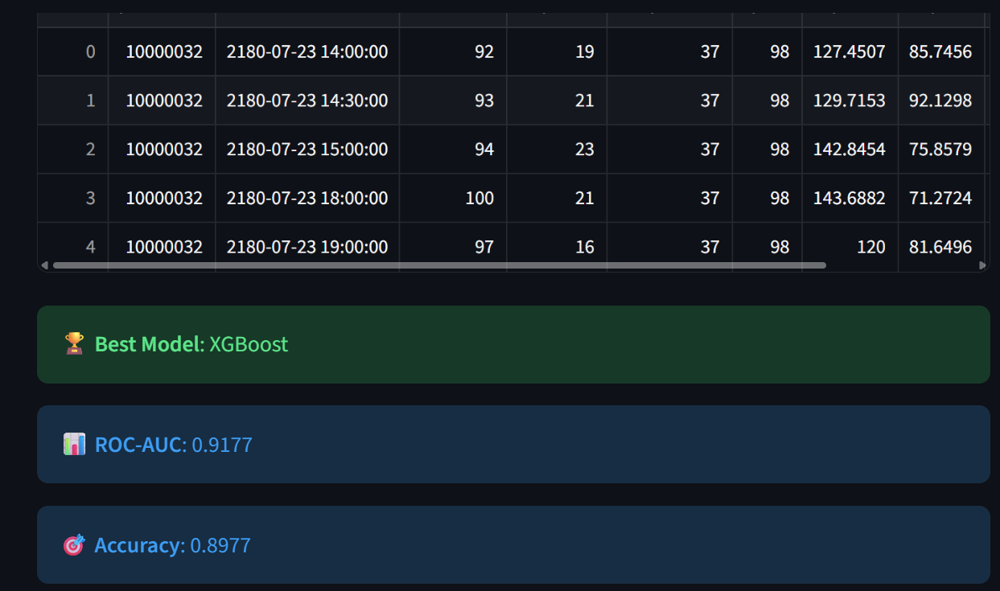
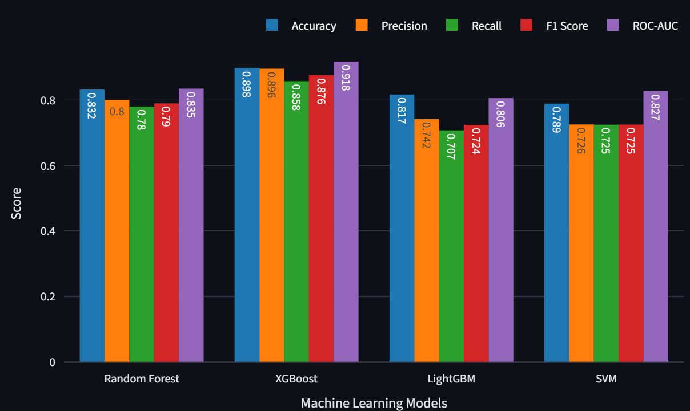

# 🏥 AI-Driven Early Warning System for Delirium Prediction

## 📌 Overview
Delirium is a serious condition in hospitalized patients that leads to longer
hospital stays and poor recovery. This AI-based system predicts delirium risk
early — before symptoms appear — so doctors can take preventive action in time.

## 🎯 Objective
- Predict delirium risk in ICU / hospitalized patients at an early stage
- Help medical staff prioritize high-risk patients
- Reduce delayed diagnosis using machine learning models

## 🧠 How It Works
1. Patient clinical data is given as input (age, vitals, lab values, medications)
2. Data is cleaned and preprocessed
3. ML model predicts: Low / Medium / High risk of delirium
4. Doctors use this risk score to take early preventive action

## 🛠️ Technologies Used
- Python
- Scikit-learn
- Pandas & NumPy
- Matplotlib & Seaborn

## 📊 Model Performance
- Algorithm: [write your algorithm here — e.g. Random Forest]
- Accuracy: [write your accuracy here — e.g. 87%]

## 📸 Output

## ⚙️ How to Run
1. Clone the repository
2. Install libraries:  pip install -r requirements.txt
3. Run the project:  python main.py

## 🎓 Project Info
- Final Year B.Tech Project – CSE
- Developer: Praveena Maganti
- Domain: Healthcare + Artificial Intelligence
